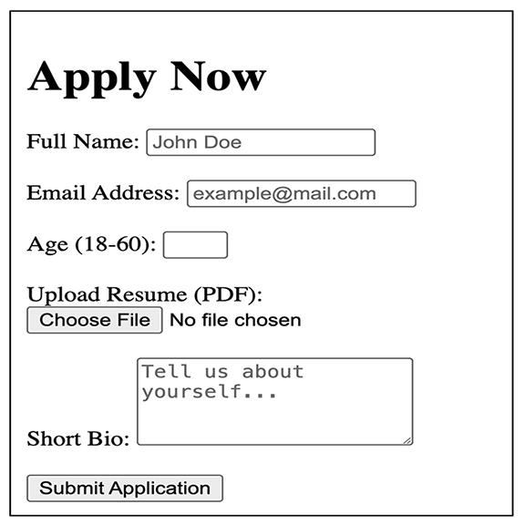

# WDE2 Interactive Forms

### Basic Form with Media Types and Validations



## Description

In this assignment, you will create a basic form that includes various media types and validations. This form allows users to submit their personal details such as name, email, age, resume, and a short bio. The form uses basic HTML5 features like input validation and file upload to ensure the data is entered correctly.

Let's code this together as a class!

## Project Structure

```
WDE2-Interactive-Forms/
└── index.html
```

## Setup

1. **Create the project folder**: 
   - Create a new folder on your local machine and name it `WDE2-Interactive-Forms`.

2. **Create the HTML file**:
   - Inside the `WDE2-Interactive-Forms` folder, create a new file named `index.html`.

3. **Prepare for development**:
   - Open the `index.html` file in your preferred code editor.

## Instructions

You are now ready to begin coding your basic form with media types and validations!

### HTML Coding

Start with the basic HTML structure:

```html
<!DOCTYPE html>
<html lang="en">
<head>
  <meta charset="UTF-8">
  <meta name="viewport" content="width=device-width, initial-scale=1.0">
  <title>Basic Form with Media Types and Validations</title>
</head>
<body>
  <!-- Form content goes here -->
</body>
</html>
```

### Building Out the Basic Form

Next, you will build out the form within the `<body>` tag. This form will include various input fields, each with specific validations.

#### Step-by-Step Explanation of the Form Tags

1. **Heading (H1)**:
   ```html
   <h1>Apply Now</h1>
   ```
   - The `<h1>` tag defines the main heading of the webpage.
   - This is the largest and most important heading tag, indicating the primary purpose of the page, which in this case is "Apply Now."

2. **Form Tag**:
   ```html
   <form></form>
   ```
   - The `<form>` element is used to collect user input.

3. **Full Name Input**:
   ```html
   <label for="name">Full Name:</label>
   <input type="text" id="name" name="name" required minlength="2" placeholder="John Doe">
   ```
   - The `<label>` element provides a label for the input field, improving accessibility. The `<label>` and `<input>` elements should be placed inside the previous `<form>` tags
   - The `for="name"` attribute connects the label to the input field with the id `name`.
   - `<input type="text">` creates a single-line text input.
   - The `required` attribute ensures the field must be filled out before submission.
   - The `minlength="2"` attribute specifies that the input must have at least 2 characters.
   - `placeholder="John Doe"` provides a hint to the user of what to enter.

4. **Email Address Input**:
   ```html
   <label for="email">Email Address:</label>
   <input type="email" id="email" name="email" required placeholder="example@mail.com">
   ```
   - `<input type="email">` creates an input field for email addresses, which validates the email format automatically.
   - `required` ensures this field is mandatory.

5. **Age Input**:
   ```html
   <label for="age">Age (18-60):</label>
   <input type="number" id="age" name="age" required min="18" max="60">
   ```
   - `<input type="number">` creates a number input field.
   - The `min="18"` and `max="60"` attributes restrict the input to between 18 and 60.

6. **Resume Upload**:
   ```html
   <label for="resume">Upload Resume (PDF):</label>
   <input type="file" id="resume" name="resume" accept=".pdf" required>
   ```
   - `<input type="file">` allows the user to upload files.
   - The `accept=".pdf"` attribute restricts the file type to PDFs.
   - `required` ensures that a file must be uploaded before submission.

7. **Short Bio Textarea**:
   ```html
   <label for="bio">Short Bio:</label>
   <textarea id="bio" name="bio" rows="4" maxlength="200" placeholder="Tell us about yourself..."></textarea>
   ```
   - `<textarea>` creates a multi-line text input.
   - `rows="4"` sets the height of the textarea.
   - `maxlength="200"` restricts the input to a maximum of 200 characters.

8. **Submit Button**:
   ```html
   <button type="submit">Submit Application</button>
   ```
   - `<button type="submit">` creates a button that submits the form when clicked.

### Full Form Code

Here is the complete code for the form, placed between the `<body>` tags:

```html
<!DOCTYPE html>
<html lang="en">
<head>
  <meta charset="UTF-8">
  <meta name="viewport" content="width=device-width, initial-scale=1.0">
  <title>Basic Form with Media Types and Validations</title>
</head>
<body>
  <h1>Apply Now</h1>

  <form action="/submit" method="post">

    <label for="name">Full Name:</label>
    <input type="text" id="name" name="name" required minlength="2" placeholder="John Doe">

    <br><br>

    <label for="email">Email Address:</label>
    <input type="email" id="email" name="email" required placeholder="example@mail.com">

    <br><br>

    <label for="age">Age (18-60):</label>
    <input type="number" id="age" name="age" required min="18" max="60">

    <br><br>

    <label for="resume">Upload Resume (PDF):</label>
    <input type="file" id="resume" name="resume" accept=".pdf" required>

    <br><br>

    <label for="bio">Short Bio:</label>
    <textarea id="bio" name="bio" rows="4" maxlength="200" placeholder="Tell us about yourself..."></textarea>

    <br><br>

    <button type="submit">Submit Application</button>
  </form>
</body>
</html>
```

### Key Points Recap

- **Form Structure:** Organized and easy to understand.
- **Input Fields:** Validated for accuracy and proper data entry.
- **Accessibility:** Labels associated with form controls for better usability.
- **Heading (H1):** Clearly defines the purpose of the form.


## Testing Suggestions

After completing the form, open the `index.html` file in a web browser to test the form's functionality.

1. Try submitting the form without filling in some of the required fields, such as the name, email, or resume. Observe how the browser prevents the form from being submitted and highlights the missing fields.
2. Try entering an incorrectly formatted email address or an age outside of the specified range (18-60). Observe what happens and how the browser enforces these validations.
3. Ensure all validations work as expected, such as the correct format for email and the age constraints.

## Conclusion

By completing this assignment, you should have gained an understanding of how to create a simple HTML form with various input types and built-in validation. This knowledge is fundamental for collecting user data in web applications.

##

© All rights reserved to ThriveDX